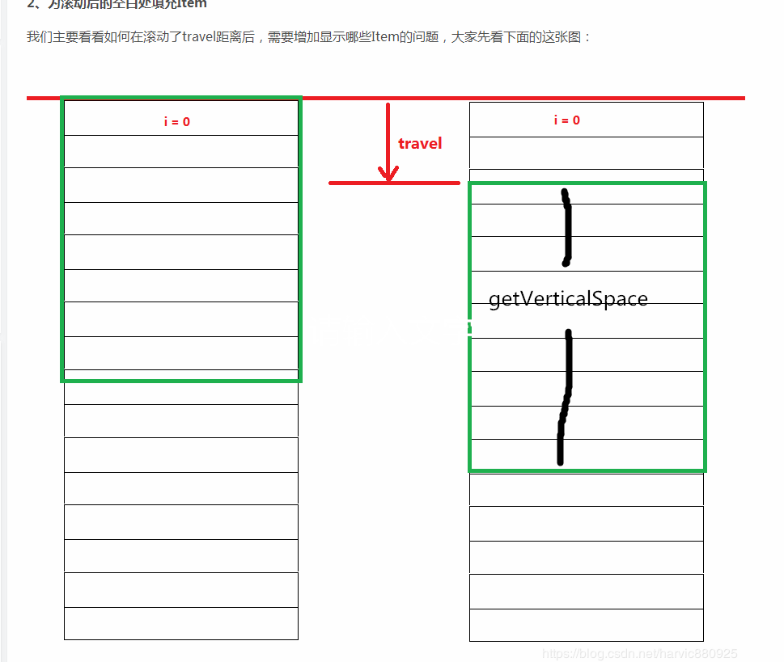

# CoordinatorLayout 
## 1. CoordinatorLayout 的 behavior 怎么工作的
### 1.1 自定义Behavior 放的全类名
* parseBehavior 解析布局文件中制定的 Behavior
### 1.2 Behavior到底是怎么实例的，调用 parseBehavior 解析我们设置的 layout_behavior , 
* 1.获取设置好的全类名  xxx.xx.xx 还可以是  .xx 
* 2.通过类名获取 class 然后获取两个参数的构造方法
* 3.通过反射创建 Behavior 对象 newInatence() , 把所有的 behavior
 放入了集合 
### 1.3 CoordinatorLayout的调用
* 1.CoordinatorLayout 里面有一个 onNestedScroll
  方法，里面for循环调用子View的Behavior的onNestedScroll的方法
  CoordinatorLayout 自己并没有调用 onNestedScroll方法
* 2.RecyclerView 里面 startNestedScroll -> ViewParentCompat.onStartNestedScroll() -> IMPL.onStartNestedScroll()
-> ViewParentCompatLollipopImpl  
### 1.4  CoordinatorLayout的LayoutParams
* Behavior 是layout_behavior 只能由
  CoordinatorLayout的LayoutParams去解析 
### 1.5 Behavior和NestedScrollingParent2的关系
* Behavior的onNestedPreScroll和onNestedScroll都是在NestedScrollingParent2中的对应方法调用的(循环调用子View的Behavior的onNestedScroll的方法
)

### LayoutManager

```java
    private Rect getVisibleArea(int travel) {
    Rect result = new Rect(getPaddingLeft(), getPaddingTop() + mSumDy + travel, getWidth() + getPaddingRight(), getVerticalSpace() + mSumDy + travel);
    return result;
}
  ```
* 其中mSumDy表示上次的移动距离，travel表示这次的移动距离，所以mSumDy + travel表示这次移动后的屏幕位置。
在拿到移动后的屏幕以后，我们只需要跟初始化的item的位置对比，只要有交集，就说明在显示区域，如果不在交集就不在显示区域。

* 那么问题来了，我们应该从哪个item开始查询呢？因为在向上滚动时，底部Item肯定是会空出来空白区域的，
很明显，应该从当前屏幕上最后一个item的下一个开始查询即可，如果在显示区域，就加进来。那什么时候结束呢？我们只需要一下向下查询，直到找到不在显示区域的item，那么它之后的就不必要再查了。就直接退出循环即可


